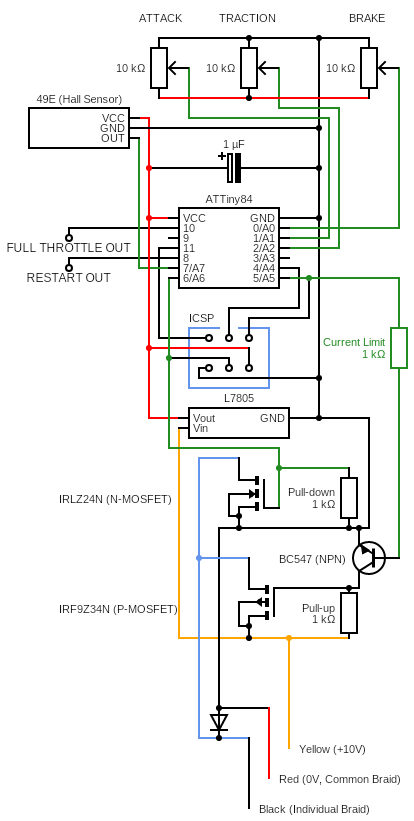

# The Open Slot Car Controller Project
OSCC has the goal to provide a cheap option to hobby-grade slot car controllers.

## Description
The heart of OSCC is a ATTiny84 microcontroller running Arduino.
The Arduino reads analog input from the throttle hall effect sensor
and the settings potentiometers. The inputs are converted into two
PWM outputs. One PWM drives the P-Channel MOSFET that enables the
car to move forward. The other PWM shorts the motor circuit to enable breaking.

## Usage
Short `CALIBRATION_PIN` and `GND` to calibrate the trigger. Move the trigger
from full brake to full throttle a few times. Remove the short to `GND`. The
controller should now use the new calibration. The calibration is saved in EEPROM
and will persist between restarts.

### Adjustments
Three analog values can be fed into the controller. This is preferably done using
three potentiometers.

`ATTACK_ADJ_PIN` sets the "Attack" of the car. This is the initial value for when
the trigger is gently squeezed.

`BRAKE_ADJ_PIN` sets the strength of the brake, when the trigger is fully released.

`TRACTION_ADJ_PIN` controls how fast the throttle can increase.

## Circuit
The circuit is built for a track running at 10-12 Volts with the shared braid beeing the
negative(ground). The controller should be hooked up to:
- Red: Track ground (minus from power supply and left braid).
- Black: Right braid.
- Yellow or White: Track +10-12 Volts.

The complete circuit:

